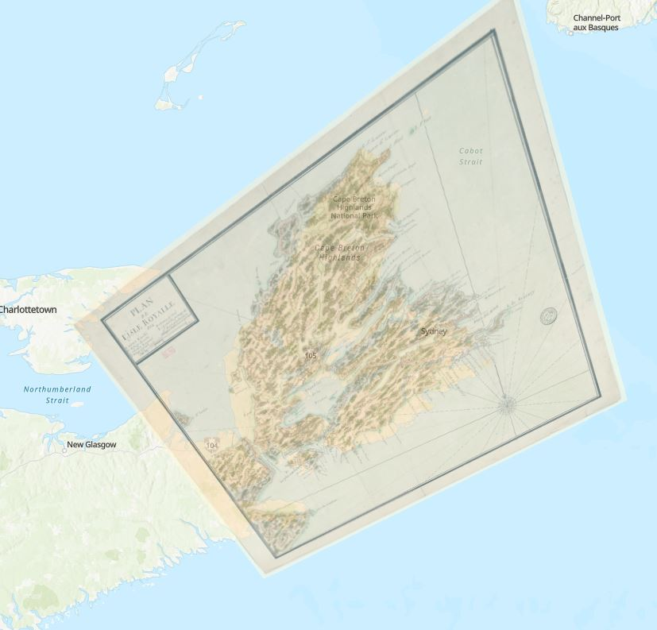

# ArcGIS Online Georeferencing Tutorial
This tutorial will show you how to georeference historical maps using ArcGIS Online as of 2023. Georeferencing is a process that binds images to coordinates on a map, making a historical map image connected to a virtual map with accurate coordinate systems

----

----

## Setup Instructions
In preparation for this tutorial, you will need...

 - Institutional access to [ArcGIS Online](https://www.arcgis.com/index.html#). through your school's Office 365 Account
 - A high resolution JPG File of a map
 - Internet Access

----

## Tutorial Steps

1. Download Data
2. ArcGIS Online
3. Access Map Viewer
4. Add Media Layer
5. Adjust Transperency
6. Adjust Image Size
7. Georeferencing Anchor Points in Side-By-Side
8. Final Adjustments
9. Save Your Map
10. Accessing and Sharing Your Map

----

## Step 1 Download Data
The first thing you want to do is download your data, in this case a JPG image of the map. 
Take note of where you stored the data on your computer, for example the downloads folder. 

----

## Step 2 ArcGIS Online
Next, open a browser and go to [ArcGIS Online](https://www.arcgis.com/index.html#)

Click Sign In. 

Under the sign in page in YourArcGis Organization URL section, type Brock and click continue. 

Click the blue box that says Brock University, then sign into your student Office 365 account. 

This will bring you to the homepage of ArcGIS Online. 

----

## Step 3 Access Map Viewer

Once at the homepage, look in the left corner and click Map. 

This will bring you to the MapViewer, where you will be creating your map. 

Zoom into the area on the map that you will be adding your historical map image to, in this case, Cape Breton. 

----

## Step 4 Add Media Layer

On the left hand side of the screen, under layers, find the button that says ‘Add’ and click the drop down button. 

At the bottom of the drop down menu, click ‘Add Media Layer’ 

In the pop up for ‘Add Media’ click ‘Your Device’ then navigate to the folder where your map image is, in this case, the downloads folder. 

Select the image file and press open. 

A new page will load, adding your image to the web map. 

----

## Step 5 Adjust Transperency

The slider on the bottom of the screen lets you adjust the transparency of your image to help you place your historical map on the web map. 

Adjust the transparency so that you can see the outline of your historical map and the features of the web map through it. 

----

## Step 6 Adjust Image Size

The orange box around your image allows you to rotate and adjust the size of your image on the web map. 

Click and drag your image over the area you want to join it to and adjust the size to roughly fit the size of the landmass on the web map. 

Rotate and adjust the image size as needed. 

You will start to see how the historical map fits into the shape of the land mass on the web map. 

Many historical maps were made before there were universal standards for mapping globally, many historical maps will not fit perfectly on the web map. 
This is because the coordinate systems are different and the hand drawn features of the historical map may not be accurate. 

That is ok, it does not need to fit exactly. 

We use georeferencing to get a close approximation of the two maps to fit, but they will never be perfect. 

It is okay and inevitable that your historic map will be skewed in this process. Aim to have your map fit as well as it can, and still be legible. 

----

## Step 7 Georeferencing Anchor Points in Side-By-Side

Once you have roughly matched the size and angle of your image to the web map, go to the bottom left corner of the screen and click ‘Side by Side’. 

A new screen will pop up with the image on the left side and the web map on the right side of the screen. 

There will be blue and orange points on both the web map and the image.

On the bottom of the screen, adjust your transparency to around 50%. 

The orange and blue points on the web map and the image correspond with each other. These act as anchor points for where your image joins to the map.

 

On the image panel, move one of the anchor points to an easy to identify point on the historical map image. 

Then, on the web map panel, move the same anchor point to the corresponding feature on the web map. 

This process allows us to match known locations to one another, skewing the image to fit the web map. 

Do this for all four anchor points. 

You may have to do this several times, adjusting as you see fit. Just aim to have the area you will use most on your map as accurate as possible. 

If you are interested in having a more accurate representation of your historical map, the desktop software [ArcGIS Pro](https://www.youtube.com/watch?v=GqH4UHTUf2s) allows you to create unlimited anchor points, leading to a more accurately georeferenced map. Look into this further if you are interested in using this process in the future. 

----

## Step 8 Final Adjustments

Once you have your anchor points adjusted, click the ‘Overlay’ button at the bottom left side of your screen. 

Take a look at how your historic map matches up to the web map, adjust the transparency, size and rotation as needed. 

Again, your historic map will never perfectly fit the web map, just adjust until you are happy with how it fits and is as accurate as you can get it for the areas you are going to use. 

Once you are done, click ‘Update and Close’ on the bottom right corner of your screen. 

You will now see your historic map overlayed onto the web map. 

You can zoom in to see how it looks, and adjust the transparency as you like. I recommend setting your transparency to around 25%. 

Now your map is georeferenced. 

----

## Step 9 Save Your Map

Go to the left side of the screen in the black toolbar, and click ‘Save and Open’. 

Then select ‘Save As’. 

Title your map, and add your course code to the ‘tags’ section. 

Then, under summary write a brief description of the map, including the citation information and your name. 

Click Save. 

----

## Step 10 Accessing and Sharing Your Map

Navigate back to the [ArcGIS Online](https://www.arcgis.com/index.html#) Homepage and click ‘Content’ on the top of the screen. 

Your saved map will appear here as a web map. 

On the right side of the screen, click the person symbol to update sharing and choose ‘Everyone (public), click save. 

You can now share your map to anyone by clicking on the title and copying the URL of the web page. 

----

## Video of this Tutorial

To see this tutorial in action, watch the video. 

----

## Additional Resources

For related tutorials check out the links below. 

ArcGIS Online

-[Introduction to ArcGIS Online](https://brockdsl.github.io/Introduction-to-ArcGIS-Online/Tutorial)

-[ArcGIS Storymaps](https://brockdsl.github.io/ArcGIS-StoryMaps-Workshop/)

-[ArcGIS Online Help](https://doc.arcgis.com/en/arcgis-online/reference/view-maps.htm)

Advanced Tutorials

-[Geocoding](https://brockdsl.github.io/ArcGIS-Geocoding/)

-[Joining Data](https://brockdsl.github.io/ArcGIS_Joining_Data/)

-[Visualization](https://brockdsl.github.io/ArcGIS_Visualization/)

-[Layout](https://brockdsl.github.io/ArcGIS-Layout/)

Brock University Map Data and GIS LIbrary often hosts workshops for learning and teaching with GIS. 
Check out the [MDGL Website](https://brocku.ca/library/mdgl/) to see upcoming workshops and tutorials. 

----
**This tutorial is supported by the Brock University Research Lifecycle Department.  If you have any questions or concerns regarding this tutorial, don't hesitate to contact [DSL@Brocku.ca](mailto:DSL@Brocku.ca)**
